# Smaail Ouzddou
### Software Engineering Student — Systems, Backend & Applied AI

  
  
  
  

 

## Profile

Software Engineering student at 1337 (42 Network) with a strong foundation in systems programming (C/C++) and university-level mathematics. Hands-on experience building AI-integrated backend services, Retrieval-Augmented Generation pipelines, and containerized multi-service infrastructure — comfortable working from low-level systems logic up through cloud-native deployment.

**Open to:** Software Engineering internships · Backend / AI engineering roles · Open-source collaboration

 

## Experience

### `ft_transcendence` — AI Service & Matchmaking Engine
**Role:** Owned the AI and compatibility logic for a full-stack platform

- Engineered a Python/FastAPI microservice to integrate the platform's AI features into the backend
- Integrated the Gemini LLM to process user input and generate personalized, context-aware bios
- Designed a matchmaking algorithm that scores user compatibility from structured lifestyle-preference data

`Python` `FastAPI` `Gemini LLM` `Microservices`

### RAG System — Automated Resume Evaluation
**Role:** Designed and built the retrieval pipeline

- Built a Retrieval-Augmented Generation pipeline (Python, LangChain) to index and query resume context
- Implemented semantic search and context retrieval to ground LLM output in source documents, reducing hallucinated responses

`Python` `LangChain` `Semantic Search` `RAG`

### `Inception` — Containerized Infrastructure
**Role:** Sole architect of the deployment environment

- Designed a multi-service demo environment (Docker Compose, NGINX, WordPress, MariaDB) simulating a production topology
- Configured service isolation and reverse-proxy routing across containers

`Docker Compose` `NGINX` `MariaDB` `Linux`

 

## Technical Skills

  

| Category | Skills |
|---|---|
| Languages | C, C++, Python, JavaScript, TypeScript, Bash |
| Backend & APIs | Node.js, NestJS, FastAPI, RESTful API design, microservices architecture |
| AI / ML | LLM integration (Gemini), LangChain, RAG pipelines, semantic search |
| Infrastructure | Docker, Docker Compose, Linux, Git, NGINX, TCP/IP, multithreading |

 

## Education

**1337 (42 Network)** — Software Engineering
Project-based, peer-reviewed curriculum with no lectures — systems programming, algorithms, networking, and DevOps, assessed entirely through shipped projects and peer code review.

  

 

## GitHub Activity

  
  

  

 

## Contact

I'm currently looking for **Software Engineering internships** and open to backend / AI engineering collaboration. Feel free to reach out.

Thanks for stopping by 👋

