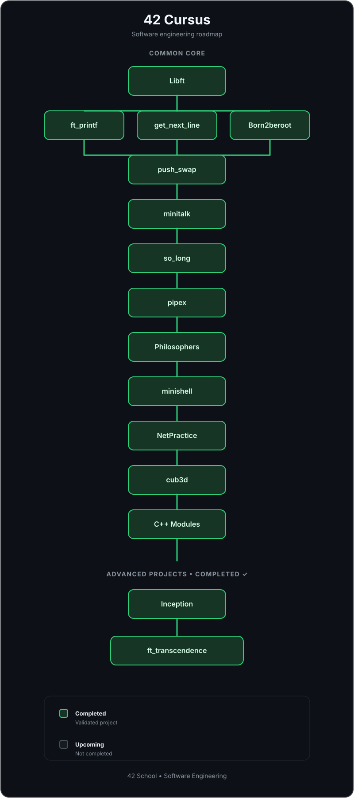

# Smaail Ouzddou — 1337 Software Engineer Student 👋

> Analytical and adaptable Software Engineering student driven by a passion for complex problem-solving. Strong foundation in university-level mathematics and systems programming (C/C++). Applied advanced concepts in distributed systems, AI microservices, and containerized infrastructure.

  
  
  

---

## Summary

Analytical and adaptable Software Engineering student focused on complex problem-solving, systems programming, and applied AI engineering. Experience designing matchmaking logic, building RAG systems, and architecting containerized microservices. Skilled at bridging low-level systems knowledge with modern cloud-native technologies.

---

## Project experience

### ft_transcendence — AI service & matchmaking logic
- Owned AI and compatibility logic for a full-stack platform; engineered a Python/FastAPI microservice for backend integration.
- Integrated Gemini LLM to process user inputs and generate personalized bios, improving engagement.
- Designed a matchmaking algorithm to analyze lifestyle preferences and compute compatibility scores.

### RAG system
- Built a Retrieval-Augmented Generation pipeline using Python and LangChain to index and query resume context.
- Implemented semantic search and context retrieval to ground LLM responses for automated profile evaluation.

### Inception — Docker infrastructure
- Architected a multi-service demo environment using Docker Compose, NGINX, WordPress, and MariaDB to simulate production.

---

## Technical skills

- Languages: C, C++, Python, JavaScript, TypeScript, Bash
- AI & microservices: LLM integration (Gemini), LangChain, RAG systems, FastAPI, AI matchmaking
- Backend & web: Node.js, NestJS, microservices architecture, RESTful APIs
- DevOps & tools: Docker, Docker Compose, Git, Linux CLI, TCP/IP, multithreading, observability

---

## Programming Languages

       

## Tools & Environment

     

---

## 🎓 42 Cursus

> A journey through systems programming, algorithms, networking, DevOps, and software engineering.

  

---

## My contacts

  
  
  

Thanks for stopping by 👋
